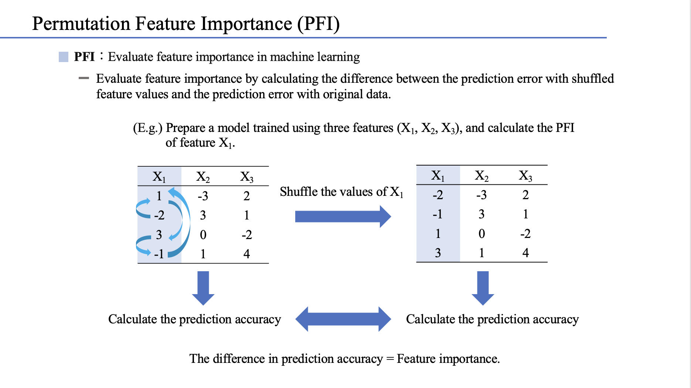
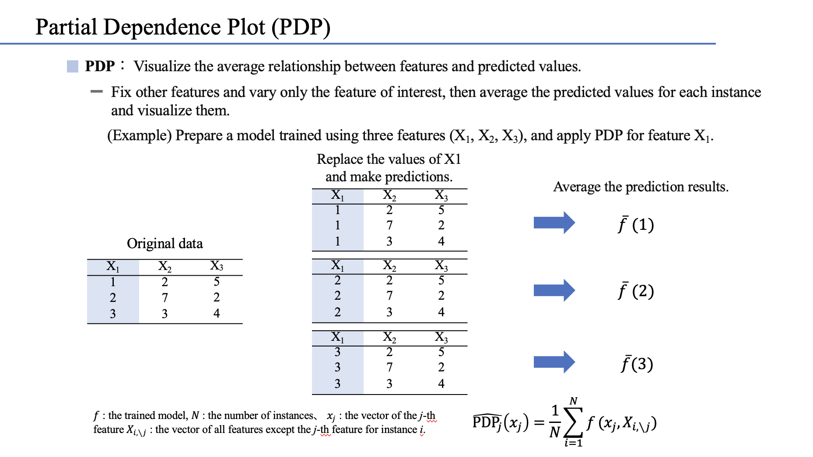
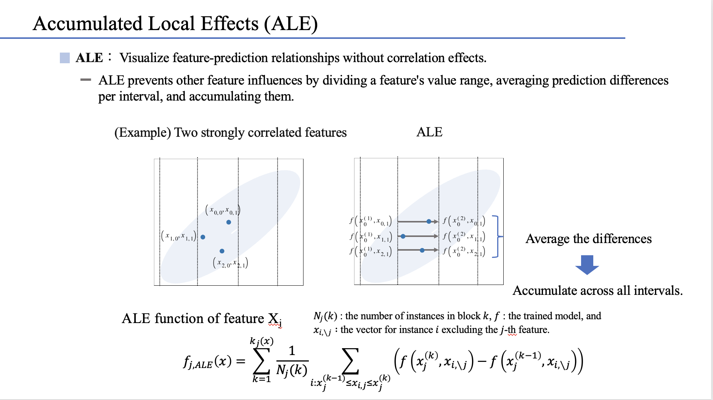

# Explainable artificial intelligence for machine learning prediction of bandgap energies

## Permutation feature importance (PFI)

PFI based on RMSE can be calculated in the `rmse_pfi` directory.

## Partial dependence plot (PDP)

The PDP of the model fine-tuned with RMSE can be calculated in the `rmse_pdp` directory.

## Accumulated local effect (ALE) plot

The ALE of the model fine-tuned with RMSE can be calculated in the `rmse_ale` directory.

